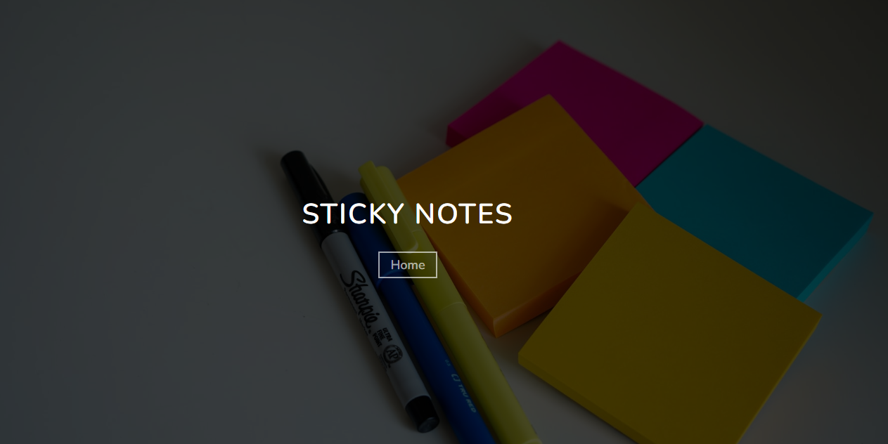

## About Sticky Notes

Sticky Notes is a Laravel Application. You can Notes your important quotes or anything.

## Project Information

## Contributing

You can contribute this Application !

## License

The Laravel framework is open-sourced software licensed under the [MIT license](https://opensource.org/licenses/MIT).
